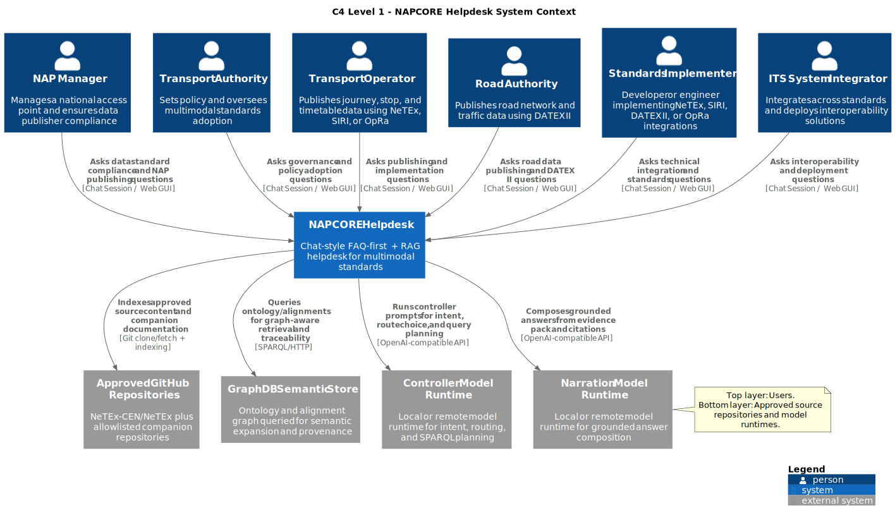

# NAPCORE Helpdesk

NAPCORE Helpdesk is a FAQ-first, RAG-fallback helpdesk for transport standards.
It answers user questions from approved standards repositories, provides evidence and citations, and supports a human editorial workflow before publication.

## What this repository contains

- Backend API and orchestration: Django + DRF
- Frontend web GUI: React + TypeScript + Vite
- Retrieval stack: lexical + vector retrieval (pgvector in PostgreSQL)
- Optional graph expansion: GraphDB (RDF/OWL + SPARQL)
- Editorial workflow: draft -> review -> approved/rejected -> published

## Architecture at a glance

The runtime uses a split LLM path:

- Controller path: intent detection, route selection, and constrained query planning
- Narration path: grounded answer composition from evidence and citations



_Figure: C4 Level 1 system context._

Essential architecture doc:

- [Architecture overview](docs/architecture-overview.md)

## Quickstart (local)

Prerequisites:

- Python virtual environment at `.venv`
- Node.js + npm
- PostgreSQL (default local mode)

Run from repository root:

```bash
make backend-migrate
make backend-run
```

In a second terminal:

```bash
make frontend-install
make frontend-dev
```

Main URLs:

- Backend API: `http://localhost:8000/api/v1`
- Frontend user UI: `http://localhost:5173/user`
- Frontend operator UI: `http://localhost:5173/editor`

Install guides:

- [Installation (local and Docker)](docs/installation.md)

## Most used Make targets

- `make backend-check`
- `make backend-migrate`
- `make backend-run`
- `make backend-index REPO_URL=<url> REPO_PATH=<absolute-path> PROFILE=netex INCREMENTAL=1`
- `make frontend-install`
- `make frontend-dev`
- `make frontend-build`
- `make frontend-test`
- `make health`

API contract:

- [API description](docs/api-description.md)
- [OpenAPI source](api/openapi.yaml)

## Documentation

Public docs index:

- [Documentation index](docs/README.md)

Deep internal documentation has been moved to:

- `.mylocal/docs/`

## Contributing

Contribution workflow and checks are documented in:

- [CONTRIBUTING.md](CONTRIBUTING.md)

## Security and secrets

- Do not commit real credentials or API tokens.
- Keep local secrets only in ignored files like `backend/.env`.
- Use environment variables in CI/CD secret stores.
- If a token is exposed, rotate it immediately.
