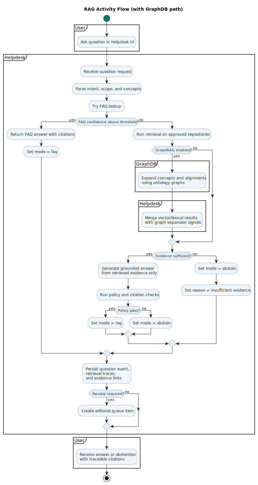

# Architecture Overview

NAPCORE Helpdesk is a FAQ-first, RAG-fallback system for transport standards.

## C4 views

- System context: [docs/diagrams/c4-system-context.svg](diagrams/c4-system-context.svg)
- Container view: [docs/diagrams/c4-container.svg](diagrams/c4-container.svg)
- Orchestrator components: [docs/diagrams/c4-orchestrator-components.svg](diagrams/c4-orchestrator-components.svg)

## Runtime flow

1. User asks a question.
2. System tries FAQ match first.
3. If FAQ confidence is low, the system runs RAG retrieval from approved repositories.
4. If GraphRAG is enabled, GraphDB expands concepts and alignments for retrieval ranking.
5. Answer generation is grounded only in retrieved evidence.
6. Policy checks enforce citation and support constraints.
7. If evidence is weak, system abstains.
8. Events and evidence links are persisted for traceability and editorial review.

## RAG architecture

- Main design: FAQ-first + RAG fallback
- Knowledge boundary: approved repositories only
- Guardrails: citation-required output and abstention on insufficient evidence
- Editorial workflow: draft -> review -> approved/rejected -> published

## RAG activity diagram (updated with GraphDB)

- PlantUML source: [docs/diagrams/rag-activity-graphdb.puml](diagrams/rag-activity-graphdb.puml)
- SVG render: [docs/diagrams/rag-activity-graphdb.svg](diagrams/rag-activity-graphdb.svg)

