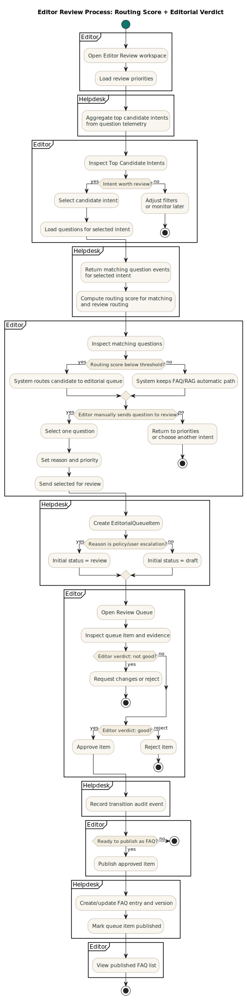

# Editor Review Process BPMN

This page documents the editor review workflow as a BPMN-style process diagram.

## Diagramming tool choice

PlantUML is used as the authoritative source because this repository already uses PlantUML for architecture diagrams and has an SVG render pipeline in place.

## Source and output

- PlantUML source: [docs/architecture/editor-review-process-bpmn.puml](editor-review-process-bpmn.puml)
- Generated SVG: [docs/architecture/editor-review-process-bpmn.svg](editor-review-process-bpmn.svg)

## Render pipeline

Run from repository root:

```bash
make diagrams-bpmn
```

This target uses [scripts/render-plantuml.sh](../../scripts/render-plantuml.sh) and writes [docs/architecture/editor-review-process-bpmn.svg](editor-review-process-bpmn.svg).

## BPMN SVG



## Scope

The diagram covers:

- review priority identification from candidate intents
- question inspection for a selected intent
- routing into editorial review
- queue transition decisions
- publication into FAQ

## Decision contract

The runtime decision model is intentionally split into two independent controls:

1. Machine score controls matching and routing.
2. Editor verdict controls status transitions and publication.

This keeps FAQ/RAG routing deterministic while preserving human accountability for publish decisions.

### 1) Score rules (matching and routing)

- FAQ match gate: publishable FAQ answer is selected only when FAQ confidence meets the minimum threshold.
	- Default threshold: 0.85 (`faqMinConfidence`, request option fallback).
- Semantic concept-confidence gate: when no explicit scope is supplied and concept confidence is too low, the system abstains and routes for clarification/review.
	- Default threshold: 0.60 (`SEMANTIC_LOW_CONFIDENCE_THRESHOLD`).
- Evidence/alignment gate (when enabled): RAG generation is blocked if evidence is insufficient or semantic alignment is below threshold.
	- Default minimum alignment: 0.30 (`EVIDENCE_GATE_MIN_ALIGNMENT`).

Operational interpretation:

- High score and policy pass: answer can proceed (FAQ or RAG path).
- Low score or weak evidence: route to editorial queue (or abstain when grounding is insufficient).

### 2) Editorial verdict rules (status and publication)

Editorial verdict is a human decision and is never replaced by the machine score.

- Good (approve): item moves from `review` to `approved`, then can be `published`.
- Not good (reject/request changes): item moves to `rejected` or back to `draft`.

The transition rules are role-gated and audited via `EditorialQueueTransition`.

### 3) Canonical status transitions

- `draft` + `submit_for_review` -> `review` (editor/admin)
- `review` + `request_changes` -> `draft` (reviewer/admin)
- `review` + `approve` -> `approved` (reviewer/admin)
- `review` + `reject` -> `rejected` (reviewer/admin)
- `approved` + `publish` -> `published` (publisher/admin)
- `rejected` + `reopen` -> `review` (editor/reviewer/admin)
- `approved` + `reopen` -> `review` (editor/reviewer/admin)
- `published` + `reopen` -> `review` (admin)

## Implementation anchors

- API routing and thresholds: `backend/helpdesk/api/views.py`
- Workflow transition rules: `backend/helpdesk/services/editorial_workflow.py`
- Queue persistence: `backend/helpdesk/services/editorial_router.py`
