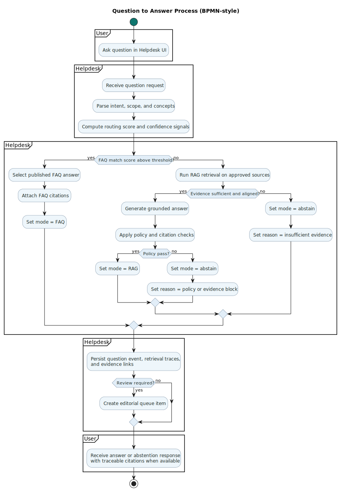

# Question to Answer Process BPMN

This page documents the runtime process from user question submission to final answer or abstention.

## Source and output

- PlantUML source: [docs/architecture/question-answer-process-bpmn.puml](question-answer-process-bpmn.puml)
- Generated SVG: [docs/architecture/question-answer-process-bpmn.svg](question-answer-process-bpmn.svg)

## Render pipeline

Run from repository root:

```bash
make diagrams-bpmn
```

The BPMN make target renders this diagram together with other BPMN diagrams.

## BPMN SVG



## Scope

The diagram covers:

- question submission in the UI
- FAQ-first matching with routing score threshold
- RAG retrieval and grounded generation fallback
- policy and evidence gating with abstention handling
- persistence of trace data
- optional routing into editorial queue
