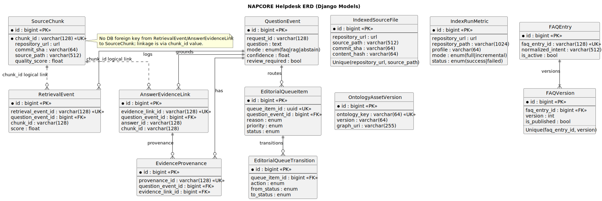

# Database Architecture

## Storage model

- PostgreSQL is the primary relational store.
- `pgvector` stores embedding vectors for retrieval.
- GraphDB is used for ontology-driven semantic expansion in GraphRAG mode.

## Relational data responsibilities

- Source ingestion: approved repositories, source documents, source chunks
- QnA runtime: question events, retrieval events
- FAQ curation: FAQ entries, FAQ versions, review workflow
- Evidence traceability: answer evidence links and provenance

## ERD

- PlantUML source: [docs/diagrams/erd-schema.puml](diagrams/erd-schema.puml)
- SVG render: [docs/diagrams/erd-schema.svg](diagrams/erd-schema.svg)

## GraphDB note

GraphDB is an external semantic store and is intentionally not represented as a relational entity in the ERD.
